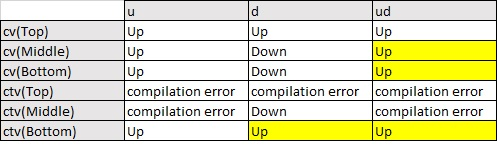

---
title: Late Binding study for F#
author: Kwon-Young Choi
footer: k1choi@enib.fr
geometry: margin=1in
...

# Introduction

The purpose of this document is to study the behavior of an object oriented language, `F#` in our case, regarding the concept of late binding.
We will talk about notion like covariance and contravariance in relation to redefinition and overload.
We will find that each language implement the object paradigm differently.
To identify what language signature F# has implemented, we will realize a simple experiment implementing a covariant and contravariant redefinition and we will print the *signature of the language F#*.

# Presentation of the experiment

We will define 5 classes :

* Top
* Middle extends Top
* Bottom extends Middle
* Up
* Down extends Up

Up and Down are classes with following methods :

* For the class Up :
    * `cv(Top t) print "Up"`
    * `ctv(Bottom b) print "Up"`
* For the class Down :
    * `cv(Middle m) print "Down"` : for covariant redefinition
    * `ctv(Middle m) print "Down"` : for contravariant redefinition

## Covariant redefinition

A redefinition like `cv(Middle m)` is called covariant because Middle is a subtype of Top.
Because there were another definition of the method cv with the type Top, `cv(Middle m)` is therefore a covariant redefinition of `cv(Top t)`.

## Contravariant redefinition

A redefinition like `ctv(Middle m)` is called contravariant because Bottom is a subtype of Middle.
Because there were another definition of the method ctv with the type Bottom, `ctv(Middle m)` is therefore a contravariant redefinition of `ctv(Bottom m)`.

## The code

```fsharp
type Top () =
    abstract member F : unit -> unit
    default u.F() =
        printfn "F Top"

type Middle () =
    inherit Top()
    override u.F() =
        printfn "F Middle"
    
type Bottom () =
    inherit Middle()
    override u.F() =
        printfn "F Bottom"

type Up ()=
    member this.cv (myTop : Top) =
        printfn "Up"
    member this.ctv (myBottom : Bottom) =
        printfn "Up"

type Down ()=
    inherit Up()
    member this.cv (myMiddle : Middle) =
        printfn "Down"
    member this.ctv (myMiddle : Middle) =
        printfn "Down"
 
let u = Up()
let d = Down()
// :> is the static cast operator
let ud : Up = Down() :> Up

printfn("testing u")
// doing ascending casting to use the cv method of class Up
u.cv(Top())
u.cv(Middle())
u.cv(Bottom())

//can't do descending casting to use the ctv method of class Up
//u.ctv(Top())
printfn("error for u.ctv(Top())")
//u.ctv(Middle())
printfn("error for u.ctv(Middle())")
u.ctv(Bottom())

printfn("testing d")
//use the method of the mother class Up
//because signature is better
d.cv(Top())
//use the method of the daughter class Down
d.cv(Middle())
//use the method of the daughter class Down with ascending casting
d.cv(Bottom())

//can't do a descending cast from an object Top to object Middle or Bottom
//d.ctv(Top())
printfn("error for d.ctv(Top())")
//using method from daughter class
d.ctv(Middle())
//using method from mother class because better signature
d.ctv(Bottom())

printfn("testing ud")
//same comportement as a pure Up object
//the ascending cast is shadowing the Down part of the object
ud.cv(Top())
ud.cv(Middle())
ud.cv(Bottom())

//ud.ctv(Top())
printfn("error for ud.ctv(Top())")
//ud.ctv(Middle())
printfn("error for ud.ctv(Middle())")
ud.ctv(Bottom())
```

## Output

```
testing u
u.cv(Top()) : 
Up
u.cv(Middle()) : 
Up
u.cv(Bottom()) : 
Up
u.ctv(Top()) : 
error for u.ctv(Top())
u.ctv(Middle()) : 
error for u.ctv(Middle())
u.ctv(Bottom()) : 
Up
testing d
d.cv(Top()) : 
Up
d.cv(Middle()) : 
Down
d.cv(Bottom()) : 
Down
d.ctv(Top()) : 
error for d.ctv(Top())
d.ctv(Middle()) : 
Down
d.ctv(Bottom()) : 
Up
testing ud
ud.cv(Top()) : 
Up
ud.cv(Middle()) : 
Up
ud.cv(Bottom()) : 
Up
ud.ctv(Top()) : 
error for ud.ctv(Top())
ud.ctv(Middle()) : 
error for ud.ctv(Middle())
ud.ctv(Bottom()) : 
Up
```

## Result

<!--+-------------+-------+-------+-------+-->
<!--|             | u     | d     | ud    |-->
<!--+=============+=======+=======+=======+-->
<!--| cv(Top)     | Up    | Up    | Up    |-->
<!--+-------------+-------+-------+-------+-->
<!--| cv(Middle)  | Up    | Down  | Up    |-->
<!--+-------------+-------+-------+-------+-->
<!--| cv(Bottom)  | Up    | Down  | Up    |-->
<!--+-------------+-------+-------+-------+-->
<!--| ctv(Top)    | error | error | error |-->
<!--+-------------+-------+-------+-------+-->
<!--| ctv(Middle) | error | Down  | error |-->
<!--+-------------+-------+-------+-------+-->
<!--| ctv(Bottom) | Up    | Up    | Up    |-->
<!--+-------------+-------+-------+-------+-->



We see that for the case 2,1 `d.cv(Top)` and case 2,6 `d.ctv(Bottom)`, the language prefers to choose a method with a better prototype than to choose the most specialized definition.


The column 3 shows us that covariant and contravariant are ignored by the language, therefore indicating us that the semantics of the language F# has mostly a *pragmatic semantics* because the language only consider the apparent type of an object.

These results inform us that F# have the same language signature as Java > 1.4. 

# Conclusion

We understand that semantic variation points of popular modeling language like UML are expressed with a lot of variability in the implementation of the object paradigm in computer languages.
In the particular case of F#, we see that this language has a pragmatic semantics like Java. This language doesn't accept covariant or contravariant definition.
