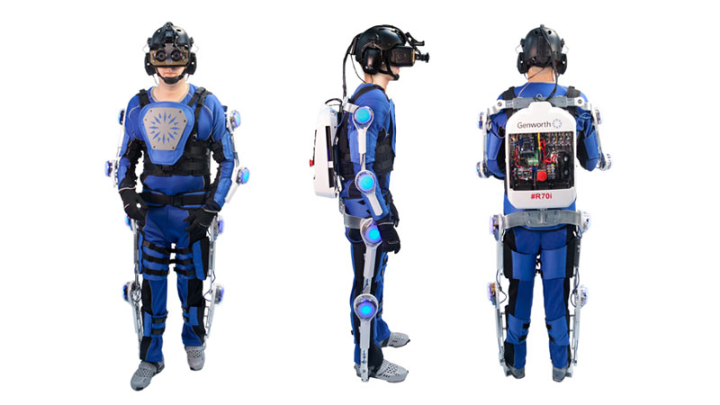

# Communities, Pratices and Usages

Problematic :
*How to structure data to be useful to human and AI*

This module has a scientific approach :

* course is theory
* practical application is for the student to do by themselves

## Collaborative Virtual Environments (CVEs)

Definition :

* digital spaces
* humans with avatars
* virtual humans with autonomous characters

CVEs lay down multiple technical problem :

* huge amount of data to process and to transport
* what data and program do we use

### Virtual Reality (VR)

Virtuality continuum :

* Real environment
  * tangible user interface
  * use of captor in the interface
* Mixed reality :
  * augmented reality

Virtual environment :

* virtual reality
* immersion
* example : CAVE

Definition from Jacques Tisseau : 

* Triptychs for VR
  * *Immersion*   , example : 3D movies
  * *Interaction* , example : video games
  * *Autonomy*    , example : computer virus

If you combine *immersion* and *interaction*
example : car simulator

If you combine *immersion* and *interaction* and *autonomie*,
it becomes **Virtual Reality**

Other Triptychs :

* Definition for Burdea & Coiffet (1993) :
  * *Immersion*
  * *Interaction*
  * *Imagination*
    * The VR need to bring the user to transpose himself in the VR
    * importance to present data and information correctly : context
* Definition for Zeltzer (1992) :
  * *Autonomy*
  * *Interaction*
  * *Presence*
    * This is a complex notion

Collaborative system pose technical problem :

* Colocalisation
* remote system

### Immersion and Presence

Definition for *Immersion* :

* technical side of VR
* *Capabilities* for users to *feel* they take part of the VE
* Simulate sensory information to match user's *proprioception*
* Enables users to act naturally in the VE
  * put effect in the VE to imitate mother nature
* can be measured precisely and independently of the user's
  experience it engenders
* example :
  * field of view
  * frame rate for vision 60 Hz
  * frame rate for haptics 1000 Hz
  * Sensitivity and precision of tracking system
  * latency

Definition for *Presence* :

* Human response to the system
* User naturally behave and feels in the virtual world
* User physiological and psychological reactions are the same
* Feeling or *Illusion* of Presence :
  * Being there
  * No mediation, vanishing of interface
  * Make the user forget that it is a *virtual* experience

Balance between *Immersion* and *Presence*.

Example with the exoskeleton

* Good precision for tracking system
* No no mediation

The book problem :

* presence = action : ecological dimension = part of a world
* presence != engagement or involvement

*Sense* or *Illusion* of Presence
From Slater and Usoh (1993) :
> L'utilisateur est ailleurs que là où il est physiquement,
> le **ailleurs** est formé par les images, sons et sensations
> physiques fournis aux ses de l'utilisateur par le système
> générant l'environnement virtuel.

From Bouvier (2009) :
> Le sentiment **authentique** d'exister dans un monde autre que
> le monde physique où notre corps se trouve.

Triptych of presence :

* Physical presence : being there + object is there
* Social presence : we are together
* Self presence : the user perceives her virtual self as real

From Lombard and Ditton (1997) :
> The conceptual definition of presence involves the idea of transportation.
> three distinct types of transportation can be identified :
> "You are there", "It is there", "We are together".

Tremendous role of *Action*

* VE should *Afford* user to act : concept of *Affordance*
[for more] (http://ai.ato.ms/MITECS/Entry/gibson1.html)
or see slide 21
* *Proprioception* : congruence between virtual and real self.
* *Causality* : real world pysics, even simple
* *Enaction* : cognition of the world comme with *embodied* action

embodied model of immersion and presence :

* Presence
  * Spatial presence
  * involvement
  * realness
* immersion
  * stimuli presentation = rendu
    * quality of immersion
    * drama
    * interface awareness
  * interaction

Assessment method of presence

* restons prudent
* post-exposure, questionnaire
  * lourd à utiliser
  * il existe déjà des questionnaires
  * static : effet global, gomme l'aspect dynamique

method to measure VR

### User Experience (UX)

definition :

* behaviors
* attitudes
* emotions
* interaction of a person with another thing
* meaningful
* valuable
* symbiose

* person's perceptions
* subjective in nature
  * relative to a subject
* constantly modified over time

Dimensions of UX

* Utility
  * correspond to the goal
* Usability
* aesthetics
  * pleased the eye
  * touch
* identification
* stimulation
  * *wow* experience
  * motivation
* value

Theory of flow

try to identificate factors of flow

* intense and focused concentration
* merging of action and awareness
  * awareness in the system
* a loss of reflective self-cousciousness
  * we become our avatar
* personal control
  * I am actor
  * self-centered
  * not passive
* distorsion of temporal experience
* experience of rewarding
  * autotelic experience

condition of flow

* clear set of goal and progress

user engagement

* focused attention
* positive affect
* aesthetics
* endurability
* novelty
  * challenge
* richness and control
* reputation, truct and expectation
* motivation, interests, incentives, and benefits

Engagement into conversations

Communication is cooperative activity

* helping action
* grounding
  * eliciting
  * referring
* commitments towards joint goals
* mutual awareness

detection of connections events

* MTBCE : Mean-Time bw Connections Events
* Directed gaze
* mutual facial gaze
* adjacency pair
* backchannel

### User Experience and Virtual Reality

### Conclusion
