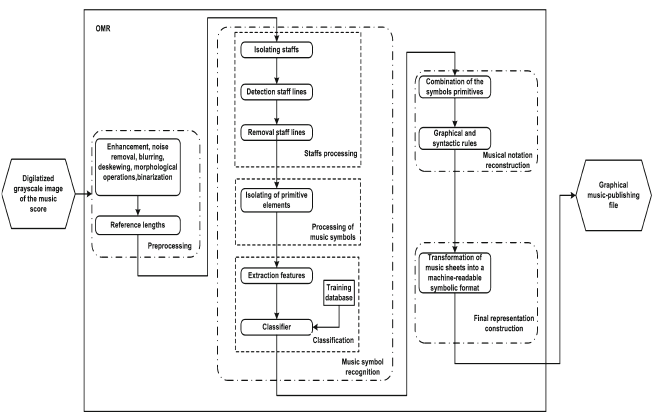

# Introduction

# Internship subject definition

* Improve dmos system for OMR.
    * pbm : improve segmentation and recognition of overlapping and broken symbols
    * way to improve dmos:
        * use new techniques of deep learning for segmenting and recognizing music symbols
    * objectif :
        * application on very large orchestral score and handwritten score
        * possible extension in electronic board schematics recognition

# Optical Music Recognition (OMR)

## Definition

Optical Music Recognition

:   Recognition, representation and storage of musical scores in a machine-readable format. [@rebelo_optical_2012]

Hybrid problem between structured document recognition and graphics recognition.

OMR usefull, because manually annotating score are very time consuming.
A lot of scores are stored in image based format.

Structure of a score:

* graphical information
    * 2D structural rules
    * hierarchical structure
    * multiple elements in scores
        * staff
        * attributive symbols at the beginnings
        * bar lines
        * notes and rests
        * slurs
        * Dynamic and tempo marking
* textual information like lyrics

Main problem in OMR:

* high density of symbols
* high connectivity between symbols
* high variation of symbols
* high combination possibilities
* overlapping and broken symbols
    * this is the main challenge nowadays

## State of art of OMR

Stage of OMR are:

* preprocessing
* staff removal
* symbol segmentation
* symbol recognition
* music score reconstruction

Main objective of this document is to study symbol segmentation and recognition.
First, fast overview of preprocessing, staff removal, music score reconstruction.
Then, extensive study of different techniques in symbol segmentation and recognition.
In OMR and then in OCR and image recognition.

### Preprocessing

Techniques reviewed in [@rebelo_optical_2012 and @fornes_analysis_2014].

* binarization
* skew correction for staff line
* noise removal for bad scanning and digitalization
* blurring
* morphological operation

### Staff removal

Staff are a group of five line that define the pitch of notes and the direction of time.
Why staff removal ?
Because they connect all symbols together, so segmentation is impossible.
Main challenge of OMR.

Main techniques reviewed in [@rebelo_optical_2012 and @fornes_analysis_2014].

* Projection and Run Lengths
    * cannot deal with overlapping symbol
    * fast to compute
* Candidates Assemblage and Contour Tracking
    * can deal with overlapping symbols
    * relatively fast to compute
* Graph Path Search
    * deal well with overlapping symbols
    * slow to compute
* Hough transform

### Music symbol segmentation and recognition

[@rebelo_optical_2009]

Variability in music symbol is source of complexity.
Digitalization and paper degradation adds noise and difficulty for this operations.
Develop problems.

Usual way of segmenting a music score:

* extract graphics primitives like:
    * line
    * blobs
    * circles
    * ...
    * joins these graphical primitives for recognition stage.
* extract symbol with template matching
    * comparison of regions of the images with templates of music symbols
    * slow to compute
    * low robustness
* simple operation
    * compute simple feature of music symbols as bounding box, projections, morphological operations
    * compare with same features extracted from an region of interest of the image to recognize a symbol.
* symbol descriptors
    * use symbol descriptors instead of the raw pixel information
        * centroids
        * Zernike moments
        * decision trees
* use of classifiers
    * HMM : segmentation and recognition phase are merged.
    * NN
    * SVM
    * k-NN

### Music score reconstruction

Interpret spatial relationship between different primitives or symbol recognized.

* Reconstruct musical notation for primitives.
* Complex two dimensional structure.
* Positional information is very important.
* Context is very important

Techniques used:

* use of fuzzy model
* use of grammar
    * grammar guide recognition
    * grammars can correct recognition errors
    * Rule based grammar: [example @couasnon_dmos:_2001]
    * Graph based grammar

#### DMOS system : Generic Document Recognition Method

The DMOS system [@couasnon_dmos:_2001] is system developed by the Intuidoc team at the Irisa lab.
DMOS

:   Description and MOdification of Segmentation.

General method for recognition of structured documents.

Main purpose is to separate the semantic and graphic knowledge of the program that do the recognition task because there is a `discrepancy between the way knowledge describe an object and the way object have to be recognized` [@couasnon_dmos:_2001].

* use a grammar for formalizing the syntax and graphical organization of the documents
    * this grammar is derived of the EPF grammar (Enhanced Position Formalism)
    * expressed in $\lambda$Prolog
    * two levels of grammar
        * physical level : image base level
        * logical level : work on the semantic level of the document
    * use simple *terminals* like line or connected components to expressed complex structures
    * use of spatial and logical operator to construct the graphical semantic of the document
* this grammar is compiled and converted into an appropriate parser that do the low-level image recognition of the image documents.
    * use of the context for segmentation and recognition
    * do as few error as possible

Used initially on OMR for orchestral scores, then on various forms, especially on old military forms.

# Symbol segmentation and classification

## Symbol classification with prior segmentation

There techniques are used after the step of segmentation.
Comparative study in [@rebelo_optical_2009].
We test regions of interest of the image using different classifiers:
Use of raw pixel inputs.
dataset is a set of symbols. 60% used for training, 40% used for validation.

* k-NN
    * simple algorithm
    * use of euclidean distance
    * better results than NN and HMM.
* NN
    * use of Multi Layered Perceptron
    * use of backward-propagation algorithm for training the neural nets
    * disappointing results
        * the study has been conducted in 2009
        * very outdated
        * there are new way of using neural nets using deep learning and recurrent neural network.
* SVM
    * radial basis function network used.
    * best classifiers at the time.
    * need first a segmentation phase

## Merging recognition and segmentation phase for classification of music symbols using HMM

Almost never implemented on OMR.
Implemented in [@pugin_optical_2006].

* avoid staff removal
* avoid segmentation phase
* because these step are important source of errors
* dataset have been generated by annotating manually partitions with graphical informations
    * 240 pages of music scores
    * 175 different symbols
* imitate speech recognition by using a sliding windows
* hypothesis of having only a succession of notes from left to right
    * do not handles chords
    * use a left-right HMM: sequential and unidirectional model
* extract 4 to 40 features from raw image
* trained using Baum-Welch algorithm.
* ~ 96% recognition rate
    * but recognition rate are highly dependent of features chose, sliding windows width ...
    * Do not consider long-term dependency

# Overview of latest techniques used in OCR and speech recognition

Main problems of OMR are segmentation and recognition of overlapping and broken symbols.
Even if printed score are well recognized, handwritten score are still very challenging for nowadays OMR systems.
These problems could be resolved by using more context information and avoiding context information.

In the history of OCR:

* First used NN or SVM for classifying letters.
* Then avoid the segmentation phase by using HMM
* Lately, using deep learning techniques and new structures of neural networks
    * avoid segmentation phase
    * use of context information by using recurrent neural network

## Using context information with recurrent neural network

### Long Short-Term Memory Recurrent Neural Network

In [@hochreiter_long_1997], presentation of a new recurrent neural network structure

* recurrent neural network have the problem of vanishing and exploding gradient during training phase
* these RNN truncate the gradient in order to avoid these problems
* ensure constant error flow through "constant error carrousels"
* unit of the network is not a neuron but a memory cell constituted of
    * multiplicative input gate unit.
        * protect memory stored in the unit from irrelevant input.
        * need to learn which error to release.
    * multiplicative output gate.
        * protect other units from irrelevant memory of the unit.
        * need to learn which error to keep.

Network Topology : 3 fully connected layer, input-hidden-output.

Network pro: have long time memory
These network could be used in OMR because they use context information.

### Multi-Dimensional Recurrent Neural Network

In [@graves_offline_2009] :

present a network architecture that is a generalisation of Bi-directional Neural Network

Bi-directional neural network is used for using past and future context for 1 dimensional data by adding recurrent connection to the previous sample and the future sample.

Multi-dimensional neural network generalized for N dimension.
For an image, it adds recurrent connection to all spatial direction.

Create flexible internal representation of surrounding context.
Robust to local distortion.

2D networks has 4 layers that scan from each corner of the image.
Single output layers, that have context from each directions.

MDRNN is trained with backpropagation alg generalized to n dimensions.

### Connectionist Temporal Classification

In [@graves_offline_2009] :

output layer.

designed for sequence labelling.

trains the network to estimate the conditional probabilities of the possible labellings.

CTC output layers contains N+1 units for alphabet of size N.
output normalized with softmax function.
0 to N units estimates the prob of obs of corresponding label
N+1 unit estimates the blank

Operator B used to removes repetition.

Objective function : negative log prob

Once trained, take the highest conditional probabilities.

Pro :

network can be trained without presegmenting the ground truth data, or postprocessing the output of the network.
Resolve the segmentation problems.

Problems :

* designed for 1D sequence labelling : in OMR, we have multidimensional output :
    * the symbol recognized
    * x and y positions of the symbol

### Network Hierarchy

In [@graves_offline_2009] :

Hierarchical approach for feature extraction.

Allow complex visual properties to be built.

* use subsampling : decrease resolution
* more feature at higher levels

Hierarchical structure : interleaves MDLSTM layers with feedforward network.
Activation of MDLSTM layers are gathered into blocks, therefore allowing subsampling.

purpose of blocks

* local contextual information
* reduce the area of the activation arrays : reduce 2D image to 1D sequences
    * subsampling

Commonly, three layers of MDLSTM/Feedforward gives the best results for OCR.
*Inverted pyramid structure* : small layer at the bottom and large at the top for efficient network.

Problems :

* This structure reduce the 2D image to a 1D sequence. but OMR output is not a 1D sequence

### A2IA recognition system proposition

Presented in [@moysset_a2ia_2014].

The Maurdor challenge is a computer vision and document recognition contest with extremely hard data to be recognized.

A2IA submit a complete system for document processing chain :

* document layout analysis
* write type identification
* language identification
* text recognition
* logical organization
* information extraction

They used the recognition previously explained, with little change :

* They changed sub-sampling filter
* Tuned hidden layer sizes for the dataset
* Used dropout during the training phase

For the training phase :
They used an automatic system for the alignment of annotations and line images.
They extracted images of a line of text of a paragraph.
The algorithm matched the image with a part of the ground truth data.

In [@messina_segmentation-free], they applied this kind of network architecture on recognizing line of handwritten Chinese text without explicit segmentation.

Deals with a large set of symbols.
Use scalable bounding boxes.

### Summary

* LSTM
    * pro : have long term depency
* MDLSTM
    * pro : robust to loncal distorsion
* CTC
    * pro : no need of segmentation
    * have only a 1D output
* Hierarchical structure
    * allow complex visual properties to be built
    * Reduce to 1D sequence

MD LSTM RNN with CTC and an Hierarchical structure could solve segmentation ambiguities for broken symbols or overlapped symbols.
Major problems is it works only on 1D sequence output.

Also, it is difficult to say if this network is robust to vertical shifting.
Notes can be shift in any vertical position of the image, for changing its pitch.

# Localizing object in image with convolutional neural network

OMR is a hybrid domain between structured document recognition and image recognition.

In [@erhan_scalable_2014], use of Deep convolutional neural network for scalable object detection and localization.

* deep network :
    * use multiple convolutional network
    * multiple max-pooling layer
    * soft-max layer as output
* in [@erhan_scalable_2014], layer can output a bounding box coupled with a confidence score
    * bounding box are not predefined
    * pros:
        * can output two dimensional graphical information
        * scalable bounding box, could be very useful in OMR where there are multiple representation of the same symbol but scaled differently
    * drawbacks:
        * they still have to be trained on data with graphical annotation which we don't have in OMR.

# Conclusion

* OMR is an hybrid domain between structured document recognition and image recognition
* difference step of OMR
    * preprocessing
    * staff removal
    * music symbols segmentation and recognition
    * reconstruction of the music score
* we want to improve the music symbols segmentation and recognition step by:
    * merging segmentation and recognition
    * use more context information
* avenue for research from OCR and speech recognition
    * using LSTM RNN for using context information
    * using CTC for automated segmentation
* avenue for research from pattern recognition
    * using CNN for generating two dimensional information like bounding boxes
* possibility to generate some musical data like sequence of notes and chords
* possible extension to electronic board schematics recognition

# References
